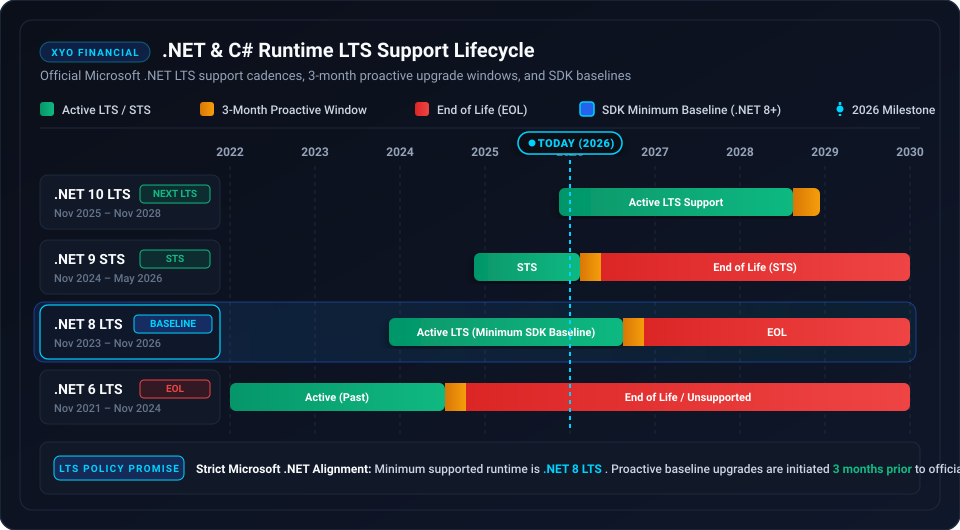

# 🛡️ Security Policy

## 📋 Supported SDK Versions

Only the `2.1.0` release of the XYO .NET SDK receives active security updates and patches.

| Version | Supported | Status |
| ------- | --------- | ------ |
| 2.1.x   | :white_check_mark: | Active GA |
| < 2.1.0 | :x: | End of Life (Unsupported) |

---

## ⚙️ Runtime Lifecycle & .NET LTS Support Policy

XYO Financial strictly adheres to official Microsoft .NET LTS support cadences. We guarantee support for the minimum supported runtime version (currently **.NET 8 LTS**) and proactively update our baseline and release upgrades **3 months before** an active runtime version reaches official End-of-Life (EOL).

### 📊 .NET Runtime Lifecycle Matrix

| .NET Version | Release Date | End of Support (EOL) | SDK Support Status | Recommendation & Policy |
| ------------ | ------------ | -------------------- | ------------------ | ----------------------- |
| **.NET 10 LTS** | November 2025 | November 2028 | 🟢 Supported (Next LTS) | Fully tested and supported upon GA release. Target runtime for forward-compatible architectures. |
| **.NET 9 STS** | November 2024 | May 2026 | 🟢 Supported (STS) | Supported for standard-term support deployments. Transition to .NET 10 LTS recommended before STS EOL. |
| **.NET 8 LTS** | November 2023 | November 2026 | 🟡 Minimum Supported Baseline | **Minimum required runtime**. Upgrade to .NET 10 LTS recommended prior to vendor EOL. |
| **.NET 6 LTS** | November 2021 | November 2024 | 🔴 Unsupported in v2.x | Deprecated. Reached official End of Life. Not supported by XYO .NET SDK v2.0.0+. |
| **.NET Core <= 3.1 & .NET Framework <= 4.8** | Legacy | Legacy | 🔴 Unsupported | Incompatible with modern HTTP/2, `System.Text.Json`, and streaming Tar abstractions. |

### 🔒 Proactive Lifecycle Transition Process

1. **Continuous Compatibility Testing:** All CI/CD test pipelines validate builds against .NET 8 LTS, .NET 9 STS, and upcoming .NET release candidates.
2. **3-Month Advance Notice:** Whenever a minimum baseline LTS reaches official Microsoft EOL, XYO Financial will issue deprecation notices 3 months in advance and advance the SDK baseline in the subsequent major or minor release.
3. **Security Patch Delivery:** Critical security patches and CVE remediations are verified across all active .NET runtime versions within guaranteed SLAs.

---

## 🏛️ Institutional Security & Defensive Engineering

The XYO .NET SDK implements strict defensive engineering controls to meet Tier-1 banking compliance:

- **Zero-Trust Egress Domain Validation (CWE-183 / SSRF):** Download links are validated against pinned domains (`api.xyo.financial`, `download.xyo.financial`, AWS S3 storage hosts) and strict HTTPS schemes before dispatching network I/O.
- **Credential Leakage Prevention:** `Authorization: Bearer` headers are automatically stripped when requests are routed to third-party storage hosts.
- **Decompression Bomb Mitigation (CWE-400):** Batch TAR archive decompression enforces hard stream ceilings (`MaxArchiveBytes = 100 MiB`, `MaxEntryBytes = 10 MiB`, `MaxTarEntries = 50,000`).
- **Path Traversal & Zip Slip Defense (CWE-22 / CWE-29):** Rejects directory traversal sequences (`..`), rooted paths, and control characters in archive entry filenames.
- **CRLF Header Injection Mitigation (CWE-113):** Validates and rejects control characters in `x-api-user` and `X-Correlation-ID` headers.
- **Credential Redaction:** API keys are excluded from `ToString()` and debugger inspection windows.

---

## 🚨 Reporting a Vulnerability

If you discover a potential security vulnerability in this SDK, please do not report it publicly through a GitHub issue. Instead, report it privately:

- **Email:** security@syniol.com
- **Response Time:** We will acknowledge receipt of your vulnerability report within 48 hours and provide a detailed response on next steps within 5 business days.

### ⏱️ Incident Response SLA

| Severity | Initial Response | Remediation SLA |
| :--- | :--- | :--- |
| **Critical** (CVSS 9.0–10.0) | < 4 Hours | < 24 Hours |
| **High** (CVSS 7.0–8.9) | < 12 Hours | < 48 Hours |
| **Medium / Low** (CVSS < 7.0) | < 24 Hours | < 5 Business Days |

### ⚓ Safe Harbor

XYO Financial supports responsible security research. We will not pursue legal action against researchers who report vulnerabilities in accordance with this policy and avoid unauthorized data access or disruption of production services.
