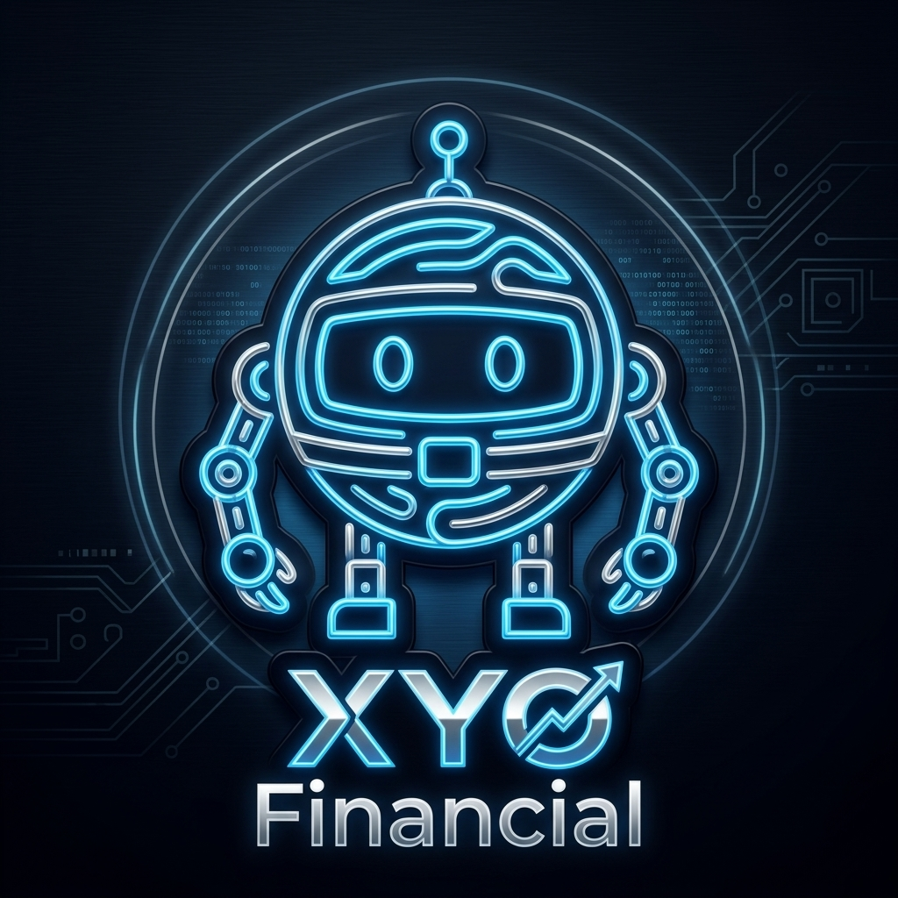

# 🤖 .NET SDK Mascot Concepts

Here are three elegant, modern variations of the .NET bot mascot tailored for the high-end financial and AI sector, utilizing only the official .NET bot assets as inspiration:

````carousel

> **Sleek Neon HFT .NET Bot**: A futuristic, sleek neon illustration of the .NET bot. Minimalist logo crafted from glowing neon blue and silver lines on a premium dark background. The 'XYO Financial' branding is prominently displayed.

<!-- slide -->

> **Platinum Geometric .NET Bot**: A highly polished, abstract geometric .NET bot made of brushed platinum and glass. Subtle glowing digital nodes on its joints and antennas represent secure corporate AI processing. Clean, premium enterprise identity on a dark background featuring the 'XYO Financial' brand.

<!-- slide -->

> **Luxury Navy FinTech .NET Bot**: A sophisticated network-graph .NET bot using a high-end palette of deep navy and subtle gold. This aesthetic screams advanced financial technology, elegance, and exclusivity, complete with the 'XYO Financial' text.
````
